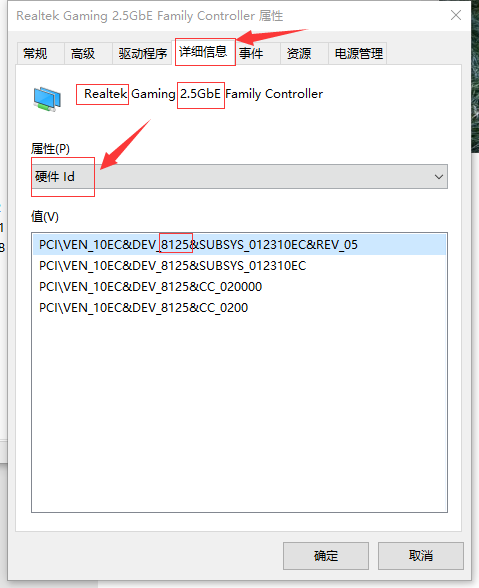

# 第 2.11 节 声卡与网卡设置

## FreeBSD 声卡

### 声音设置

声卡驱动 snd_hda 默认即加载。默认内核没有包含时要手动加载对应内核模块。

用以下命令查看当前声卡设备：

```shell-session
$ cat /dev/sndstat
Installed devices:
pcm0: <NVIDIA (0x0083) (HDMI/DP 8ch)> (play)
pcm1: <NVIDIA (0x0083) (HDMI/DP 8ch)> (play)
pcm2: <NVIDIA (0x0083) (HDMI/DP 8ch)> (play)
pcm3: <NVIDIA (0x0083) (HDMI/DP 8ch)> (play)
pcm4: <Realtek ALC892 (Rear Analog 5.1/2.0)> (play/rec) default
pcm5: <Realtek ALC892 (Front Analog)> (play/rec)
pcm6: <Realtek ALC892 (Rear Digital)> (play)
No devices installed from userspace.
```

后面带有 default 是 oss 默认设备。如果软件的音频使用的 oss 且输出是默认的，音频就会从这个设备输出。

FreeBSD 大部分软件的音频输出驱动为 oss。有些默认是 pulseaudio(比如 firefox)，这些软件的设置看最后的提示。

下列命令可以修改输出的设备。最后的数字是对应的 pcm 后面的数字。

```shell-session
$ sysctl hw.snd.default_unit=5
```

此处推荐几个 oss mixer：

| GUI 环境 |      名称       |
| :------: | :-------------: |
|   kde5   | audio/dsbmixer  |
|   gtk    | audio/gtk-mixer |
| 非图形化 | audio/mixertui  |

### 提示

部分声卡需要自行编译内核，请参考 [Open Sound System for FreeBSD](http://www.opensound.com/freebsd.html)。

但是 oss 有些缺点，使用 `obs-studio` 无法录制 oss 输出。只能录制 oss 输入。看官方论坛里，可以 `virtual_oss` 模拟一个设备实现。

但是 `obs-studio` 可以录制 pulseaudio 输出的音频。

所以有些软件可以使用 pulseaudio 作为输出。使用 pulseaudio 的软件的音频输出，不受上面的命令控制音频输出设备。pulseaudio 会根据自己的设置把音频送到对应设备，所以需要使用 pulseaudio 混音器控制。

在 kde5 下面自带的音频控制器，切换设备就是控制的 pulseaudio。

官方打包好的多媒体软件有些是支持 pulseaudio 但是这些软件中的大部分对应的编译选项没有打开。如果需要录制软件的音频输出，可以自行打开 ports 的编译选项自己编译。在软件中设置 pulseaudio 作为音频驱动输出就可以了。

## 网卡设置

### Realtek（螃蟹卡）

#### Realtek RTL8125 2.5 G 

常见 2.5 G 的网卡都是这个，即螃蟹卡。可以在 Windows 的设备管理器中查看，以下示例就是这个卡：



**该网卡默认在 FreeBSD 下是没有驱动的，需要手动安装。最简单的办法是使用通过手机 USB 共享网络临时上网，方法见本手册其余部分。安装了网卡重启即可。**

安装方法同下。

### Realtek（螃蟹卡）网卡通用安装方法：

#### 支持列表：

* 5G 网卡
  - RTL8126
* 2.5G 网卡
  - RTL8125 / RTL8125B(G)
* 10/100/1000M 网卡
  - RTL8111B / RTL8111C / RTL8111D / RTL8111E / RTL8111F / RTL8111G
    RTL8111H / RTL8118(A) / RTL8119i / RTL8111L / RTL8111K
  - RTL8168B / RTL8168E / RTL8168H
  - RTL8111DP / RTL8111EP(P) / RTL8111FP
  - RTL8411 / RTL8411B
* 10/100M 网卡
  - RTL8101E / RTL8102E / RTL8103E / RTL8105E / RTL8106E / RTL8107E
  - rtl8401 / rtl8402

#### 安装方法
  
```
pkg install realtek-re-kmod
```

配置：

```
# ee /boot/loader.conf # 写入以下两行
if_re_load="YES"
if_re_name="/boot/modules/if_re.ko"
```

默认情况下已经开启巨型帧，要关闭：

```
# sysctl hw.re.max_rx_mbuf_sz # 查看当前设置
# echo hw.re.max_rx_mbuf_sz="2048" >> /etc/sysctl.conf
```

要启用 WOL 唤醒：

```
# echo hw.re.s5wol="1"  >> /etc/sysctl.conf
# echo hw.re.s0_magic_packet="1"  >> /etc/sysctl.conf
```

以上设置完毕后均需重启。

参考文献：

- [realtek-re-kmod Kernel driver for Realtek PCIe Ethernet Controllers](https://www.freshports.org/net/realtek-re-kmod)

### Intel 网卡

## 2.5 G

英特尔 i225-V、i226-V 2.5G 网卡默认应该能驱动，但无需配置。未测试。由 `igc` 驱动。

支持列表：

 - I225-LM（商业端产品线，服务器用）
 - I225-V（桌面端产品线，常见于家用台式机）
 - I225-IT
 - I225-K

参考文献：

- [igc -- Intel Ethernet Controller	I225 driver](https://man.freebsd.org/cgi/man.cgi?query=igc)

## 千兆和百兆及其他

i210、i211 由 em 驱动。默认应该就能驱动，无需配置，但未测试。

支持列表及更多参见：

- [em, lem,	igb -- Intel(R)	PRO/1000 Gigabit Ethernet adapter driver](https://man.freebsd.org/cgi/man.cgi?query=igc)
