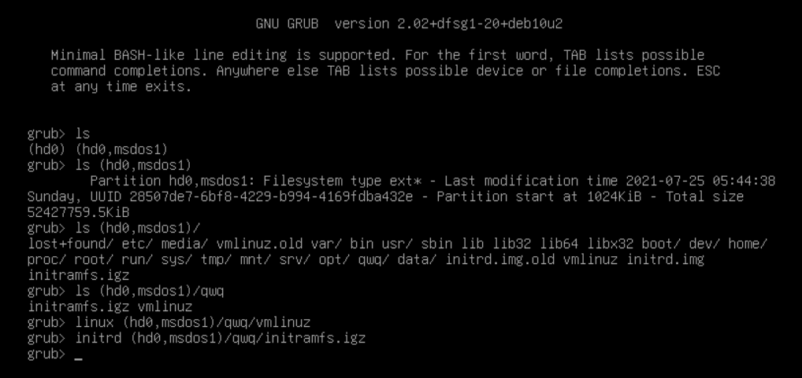
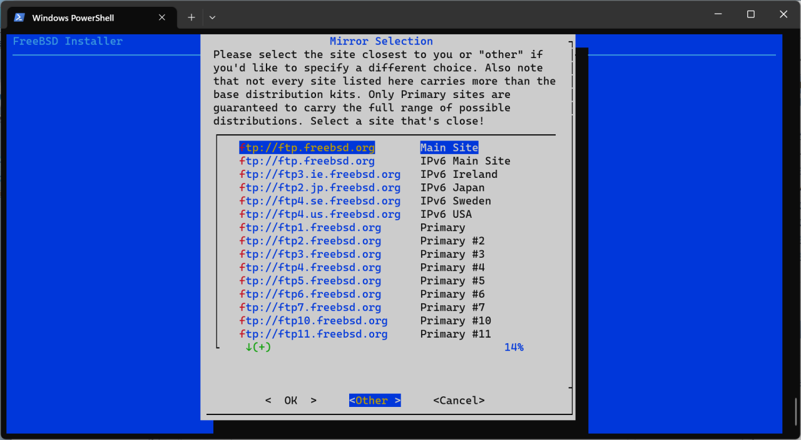
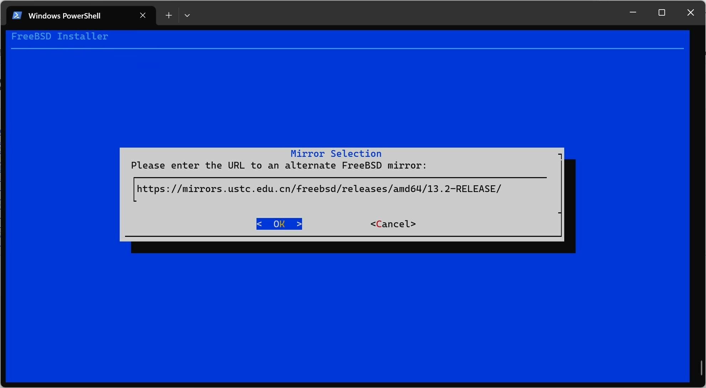
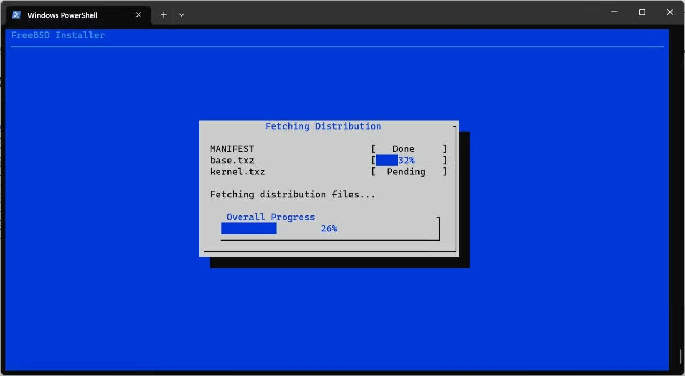
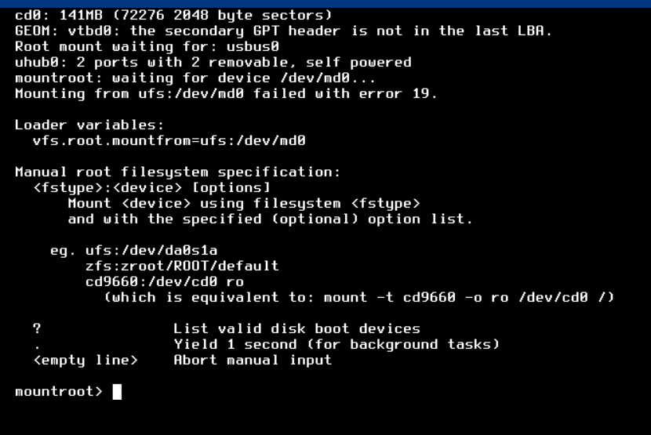

# 第 2.5 节 腾讯云轻量云及其他服务器安装 FreeBSD

> **注意**
>
> **尽管本文和 dd 没什么关系，但是如果你还不懂什么是 `dd`，不建议使用本文。这一切也许超越了你的动手能力和知识储备。**
>
> **此外，对于不再受安全支持的版本如 `9.2`，请参考本文并结合手动安装 FreeBSD 章节操作。**

>**警告**
>
>**安装前请在原有的 Linux 系统上看看自己的 IP 及 netmask，可以用命令 `ip addr` 及 `ip route show` 查看网关信息。因为有的服务器并不使用 DHCP 服务，而需要手动指定 IP。**

## 视频教程

[08-腾讯云轻量云及其他服务器安装 FreeBSD](https://www.bilibili.com/video/BV1y8411d7pp)


>视频与教程有一定出入，按哪个来都可以。
>
>SCP 命令可以用图形化的 Winscp 替代。
>
>最后安装完毕建议按照 2.7 节设置密钥登录以提高安全性。


## 文字教程

[腾讯云轻量应用服务器（即腾讯云轻量云）](https://cloud.tencent.com/product/lighthouse)以及[阿里云轻量应用服务器](https://www.aliyun.com/product/swas)等机器都没有 FreeBSD 系统的支持，只能通过特殊的的方法自己暴力安装。**请注意数据安全，以下教程有一定危险性和要求你有一定的动手能力。**

他是一个服务器面板里没有 FreeBSD 镜像 IDC，所以要用奇怪的方法来安装了。因为 FreeBSD 和 Linux 的内核不通用，可执行文件也不通用，所以无法通过 chroot 再删掉源系统的方法安装。安装的方法是先在内存盘中启动 FreeBSD 系统，也就是 [mfsBSD](https://mfsbsd.vx.sk)，再格式化硬盘安装新系统。mfsBSD 是一个完全载入内存的 FreeBSD 系统，类似于 Windows 的 PE。

我们需要下载 [img 格式的 mfsBSD 镜像](https://mfsbsd.vx.sk/files/images/13/amd64/mfsbsd-se-13.1-RELEASE-amd64.img)，可以提前下号使用 winscp 传入服务器，服务器直接下载可能需要两个小时。


### 真正的 mfsBSD 启动方法

就是因为刚才说的问题，而且 FreeBSD 和一般的 Linux 是不同的生态，我们需要先进入一个 Linux 的内存盘，再在内存中运行的 Linux 里将 mfsBSD 写入硬盘。

就在 mfsBSD 下载位置的下方，有一个 [mfsLinux](https://mfsbsd.vx.sk/files/iso/mfslinux/mfslinux-0.1.10-f9c75a4.iso)，就是我们可以用的工具。由于它只有 ISO 格式，没法直接放在当前环境下启动，而它说自己是纯 initrd 类型的，我们就把启动它的 initrd 和内核提取出来，放在硬盘里手动启动。

我们知道在一般的 Linux 系统中，initrd 是一个打包成内存盘的微型但完整的 Linux 根目录，里面有一些比如说加载驱动，挂载硬盘，以及启动初始化程序的必要数据。开机时内核与 initrd 被 Bootloader 加载，initrd 中的脚本进行启动的准备工作并运行硬盘里的初始化程序。

我们先把从那个 ISO 提取出来的内核和 initrd 文件放在根目录文件夹下，然后重启机器进入 GRUB 的命令行界面（可以在倒计时的时候按 `e` 进入编辑模式，删掉所有 `linux`、`initrd` 行原有内容，写完后按 `Ctrl X` 即可加载），手动启动指定的内核和 initrd（可以用 `Tab` 键补全路径）。

```sh
linux (hd0,msdos1)/vmlinuz
initrd (hd0,msdos1)/initramfs.igz
```

**不一定是 **(hd0,msdos1)**，以实际为准，不要一下都删掉了看不出来了。**



这个特制的 initrd 启动之后并没有加载本地的系统，而是自己连接了网络并打开 ssh 服务器。于是我们就获得了一个运行在内存中的 Linux 系统。

这个时候服务器应该就可以被 ssh 连接上了，并且可以安全的格式化硬盘。

mfsBSD 和 mfsLinux 镜像的 root 密码默认是 `mfsroot`

```sh
# cd /tmp
# wget https://mfsbsd.vx.sk/files/images/13/amd64/mfsbsd-13.1-RELEASE-amd64.img
# dd if=mfsbsd-13.1-RELEASE-amd64.img of=/dev/vda
# reboot
```

**提示：建议在此处使用服务器的“快照”功能对服务器进行备份，以防以下教程操作失误重来耽误时间。**

### 安装 FreeBSD

ssh 链接后，`kldload zfs` 加载 zfs 模块，然后运行 `bsdinstall`，在出现以下图片时，点 `Other` 输入图中的指定镜像版本（地址里有即可，你可以自己改哦）：

示例：如 <https://mirrors.ustc.edu.cn/freebsd/releases/amd64/13.2-RELEASE/> 或 <https://mirrors.nju.edu.cn/freebsd/snapshots/arm64/14.0-CURRENT/>








- 我们还可以手动下载 FreeBSD 的安装文件，以 MANIFEST 为例：

```sh
# mkdir -p /usr/freebsd-dist
# cd /usr/freebsd-dist
# fetch http://ftp.freebsd.org/pub/FreeBSD/releases/amd64/13.1-RELEASE/MANIFEST
```

### 故障排除 

- 为什么不能直接 dd？（错误示范，仅供说明，请勿执行）

　　在正常的 Linux 系统内直接把 mfsBSD 的 img dd 到硬盘里，重启之后虽然正常加载 bootloader，但是可能是因为系统又对硬盘进行了写入而无法正常挂载内存盘。

```sh
# wget https://mfsbsd.vx.sk/files/images/13/amd64/mfsbsd-se-13.1-RELEASE-amd64.img -O- | dd of=/dev/vda
```

　　这里的 `|` 是管道的意思，将上一个命令的标准输出作为下一个命令的标准输入。 `-O-` 指把文件下载输出到标准输出，而 dd 没有指定 if 时会自动从标准输入读取内容。




- 如果有云服务器用 lvm 的话，需要把东西全都放到 /boot 里面，要不然 grub 和 mfslinux 都打不开。

## 参考资料

- [Remote Installation of the FreeBSD Operating System Without a Remote Console](https://docs.freebsd.org/en/articles/remote-install/)

