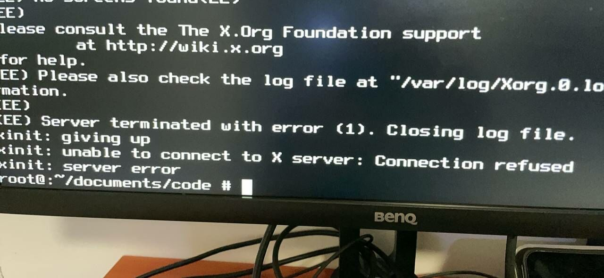

# 第 4.0 节 概述（必看）

> 所有 FreeBSD 安装介质默认均不包含图形界面（DVD 的包含部分桌面的软件包，但是安装了也无法使用），需要手动安装。**请勿使用`sysutils/desktop-installer`，会引发不必要的错误和问题。**
>
> 执着于一定要让 FreeBSD 表现出如 Linux 甚至是 Windows 一般的桌面力是一种可望而不可即的奢求，FreeBSD 官方的口号是 `The power to serve`。
>
> GhostBSD 适合对 BSD 好奇的人体验。本质上还是 FreeBSD 的预配置版本。如果是使用三个月以上的 FreeBSD 用户，不推荐这个发行版。它的软件仓库和 FreeBSD 一样，但是自己的独立服务器在国内速度感人（虽然也可以替换成 FreeBSD 的源）。

本章内容并非是让大家把所有的桌面都安装一遍，而是尽可能多地提供选择。

安装桌面的基本步骤是：① 安装显卡驱动 -> ② 安装 Xorg -> ③ 安装 KDE5/Gnome/XFCE/MATE -> ④ 安装显示管理器 sddm/lightdm/slim -> ⑤ 安装输入法等软件

Wayland 是 xorg 的替代品，但是目前 BSD 上支持 Wayland 的桌面数量为 0，有一些窗口管理器是支持的。

其中，Gnome 可省略第四步，因为其显示管理器 gdm 早就在第二步就进行了自动安装。

显示管理器推荐搭配是 ：

KDE5 + sddm

Xfce/Mate + lightdm

slim 由于作者早在 2013 年就停止了开发，不推荐使用，会产生一些奇怪的 bug （比如 fcitx5 用不了，加载不了 dbus）。

输入法框架目前推荐使用 fcitx（对于 KDE 5 桌面）、ibus（对于其他基于 GTK 的桌面，如 gnome、xfce、mate 等等）。请勿使用 scim，作者早就跑路（大概已经距今 16 年了）。

> 对于不同的 SHELL，环境变量的配置方法是不一样的，FreeBSD 14 前默认使用 `csh`，14 及以后默认使用 `sh`。而且不同桌面加载环境变量的方法也是不一样的，所以针对不同桌面，不同 SHELL 的配置方法是不一样的，具体方法请看具体桌面。

> 小故事：
>
> sddm gdm lightdm slim 在系统里乱战：
>
> sddm：我背后是 kde
>
> gdm：我背后是 gnome
>
> lightdm：我背后可以是任何一个
>
> slim：怎么办？好慌，潜水太久，管理员要踢我了。
>
> 系统：合着你们在我地盘上养蛊呢？

## 故障排除

没有安装显卡驱动。看下一节教程去安装驱动。
