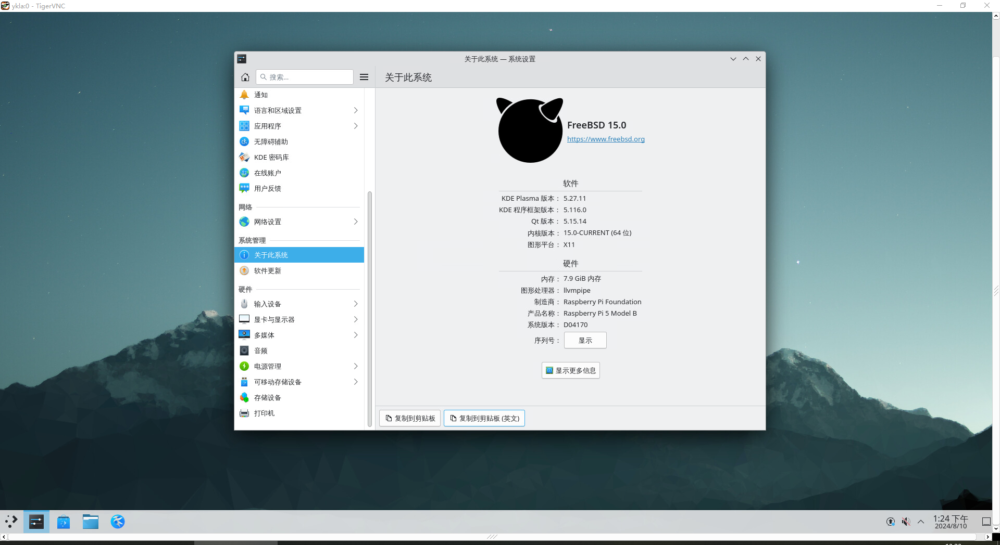
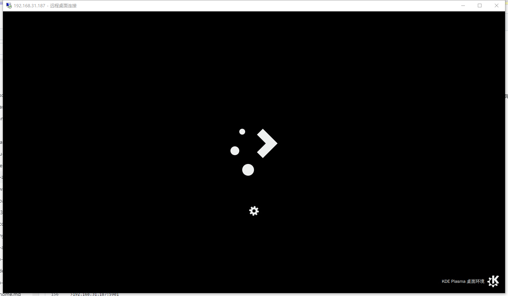
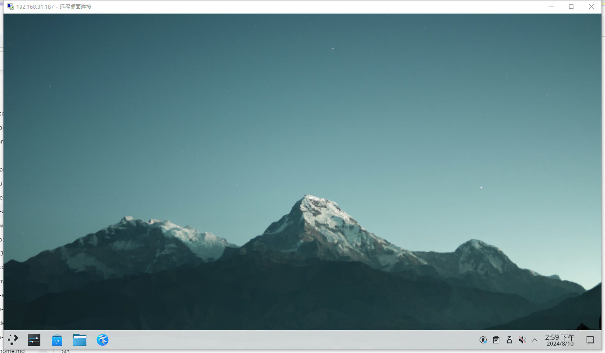
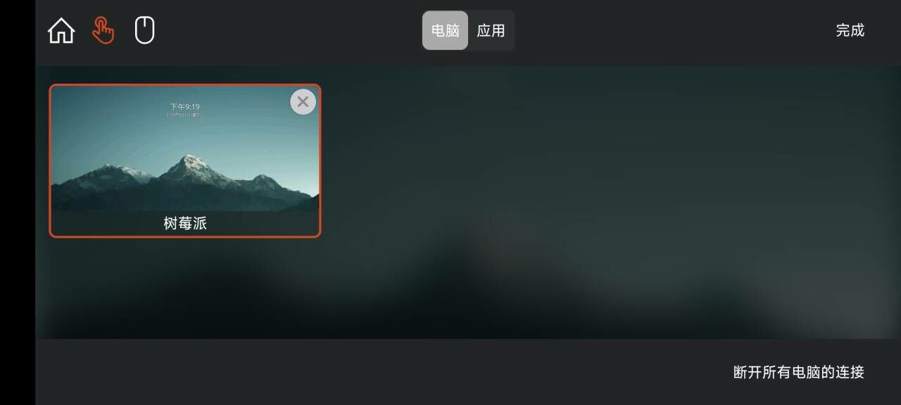
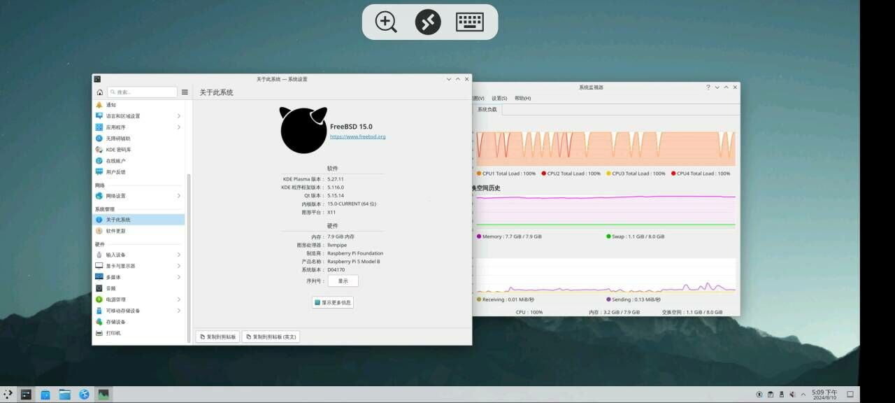

# 第 4.12 节 远程桌面管理

## VNC 与 RPD（XRDP） 对比

XRDP 是 Microsoft RDP 的开源实现。

| **特性**         | **VNC**                                                      | **XRDP**                                                     |
|:------------------:|--------------------------------------------------------------|--------------------------------------------------------------|
| **协议**         | 基于 RFB（Remote Framebuffer）协议                           | 基于 RDP（Remote Desktop Protocol）协议                      |
| **设计目标**     | 跨平台远程访问桌面环境，传输屏幕图像数据（基于像素）                     | 兼容 Windows RDP 远程访问，针对 Linux 开发（通过转发 X11 的图形原语、高级命令）（似乎现在 Windows to Windows 不是这样？请求出处。） |
| **性能**         | 图像更新效率较低，带宽和延迟敏感的网络环境下性能差            | 性能较好，适用于低带宽和高延迟网络                           |
| **资源消耗**     | 资源消耗较高，尤其是高分辨率下             | 资源消耗较低                                                  |
| **跨平台兼容性** | 支持在 Windows、Linux、macOS 等不同操作系统间的远程连接          | 主要用于 Windows 和 Linux 间的远程连接                   |
| **安全性**       | 默认未提供强加密（第三方加密亦不安全且只会增加复杂度）；主流客户端、服务器软件漏洞多       | RDP 默认支持 TLS 加密、128 位加密，安全性高                         |
| **会话管理**     | 显示当前活动会话，多用户共享同一会话；它不会保留用户的会话状态                        | 支持多用户独立会话管理，每个用户都有独立的桌面环境；用户可以在断开连接后重新连接并继续之前的会话           |
| **使用体验**     | 使用体验简单直接，适合跨平台访问                          | 使用体验接近 Windows 远程桌面，操作更流畅                  |
| **鼠标**          | 实时传输鼠标动作，响应速度受网络延迟影响较大，精度会下降           | 基于 RDP 协议，鼠标操作响应更快，更流畅；在低带宽条件下表现更好 |
| **键盘**          | 支持键盘操作，会出现输入延迟、重复输入等问题，受网络波动影响大           | 键盘输入响应更快，延迟较低，输入体验接近本地操作                      |
| **剪贴板共享**        | 通常仅限文本                               | 支持更丰富的剪贴板共享，包括文本、文件、图像等                      |
| **文件传输**          | 原生不支持文件传输          | 支持文件传输，直接在远程桌面环境中复制粘贴文件，操作方便                |
| **文件拖放**          | 通常不支持文件拖放操作                 | 支持文件拖放                                 |、
| **CPU/GPU 硬解码**    | 主要依赖 CPU 进行渲染和解码，硬解码支持有限，通常不会利用 GPU 资源       | 支持 GPU 硬解码，能有效利用 GPU 加速渲染和解码，提高性能，减轻 CPU 负担 |
| **软解码**            | 默认使用软解码，CPU 资源占用较高，影响性能                        | 软解码依赖 CPU，但性能影响较小，因为 RDP 协议优化好                      |
| **硬件直通**          | 不支持硬件直通功能                                                     | 支持部分硬件直通功能      |
|**分辨率**|由服务器控制|客户机服务器均可设置|
|**屏幕镜像**|支持|不支持|

综合上表，除了不支持屏幕镜像外，XRDP 完胜。又是 Windows 的一大优点体现。

### 参考文献

- [xrdp: an open source RDP server](https://github.com/neutrinolabs/xrdp)
- [VNC 还是 RDP? 云上的远程桌面究竟该如何选](https://aws.amazon.com/cn/blogs/china/vnc-or-rdp-how-to-choose-a-remote-desktop-on-the-cloud/)
- [UOS_远程桌面_xrdp_Xorg_x11vnc](https://www.cnblogs.com/osnosn/p/16690589.html)

## VNC

### x11vnc（镜像屏幕）

**x11vnc 会和远程软件 todesk 一样直接镜像屏幕，简言之，你的所有操作都会被同步到显示器上面，反过来在显示器上的操作，你在 VNC 上也可以看到。**

如果没有显示器则不能使用 x11vnc。

安装 x11vnc：

```
# pkg install x11vnc
```

创建密码：

```
$ x11vnc -storepasswd
Enter VNC password: 
Verify password:    
Write password to /root/.vnc/passwd?  [y]/n y #此处键入 y 回车
Password written to: /root/.vnc/passwd
```

启动服务器（KDE 5 SDDM 为例）：

```
$ x11vnc -display :0 -rfbauth ~/.vnc/passwd -auth $(find /var/run/sddm/ -type f)
```

- LightDM

```
$ x11vnc -display :0 -rfbauth ~/.vnc/passwd -auth /var/run/lightdm/root/\:0
```

- GDM

```
$ x11vnc -display :0 -rfbauth ~/.vnc/passwd -auth /var/lib/gdm/:0.Xauth #或 /run/user/120/gdm/Xauthority，取决于你的 gdm 版本，自己 ls 看一下
```



#### 参考文献

- [x11vnc -allow VNC connections to real X11 displays](https://man.freebsd.org/cgi/man.cgi?query=x11vnc&sektion=&manpath=freebsd-release-ports)
- [X11vnc](https://wiki.archlinux.org/title/X11vnc)
  
### TigerVNC

启用 VNC 服务（目前 Ports 就只剩下这个 [TigerVNC](https://www.freshports.org/net/tigervnc-server/) 了）

安装 TigerVNC Server：

```shell-session
# pkg install tigervnc-server
```

安装之后，还要做一些设置：

在终端执行命令 `vncpasswd`，设置访问密码。

创建 `~/.vnc/xstartup` 文件：


```
root@ykla:~ # mkdir -p ~/.vnc/
root@ykla:~ # ee ~/.vnc/xstartup
```

内容如下：

```shell-session
#!/bin/sh
unset SESSION_MANAGER
unset DBUS_SESSION_BUS_ADDRESS
[ -x /etc/X11/xinit/xinitrc ] && exec /etc/X11/xinit/xinitrc
[ -f /etc/X11/xinit/xinitrc ] && exec sh /etc/X11/xinit/xinitrc
xsetroot -solid grey
exec command &  #此处不能照抄！
```

注意：上述 `command` 须进行替换，**请注意保留 `&`**，在不同桌面下需要替换，Gnome 用 `gnome-session`，KDE 用 `startplasma-x11`，MATE 用 `mate-session`，Xfce 用 `xfce4-session`。

保存后执行命令 

```
# chmod 755 ~/.vnc/xstartup
```

- 接下来在终端执行命令 `vncserver` 或 `vncserver :1`。

其中“`:1`”意味着 `DISPLAY=:1`，即指定桌面显示的通信端口为 `1`，对应 VNC 服务的端口为 `5901`。桌面显示通信端口从 0 开始，但该端口已被当前桌面占用（除非是镜像 VNC），因此 VNC 服务默认端口虽为 5900，但实际执行须从 5901 开始。
>
>测试：
>
>```
>root@ykla:~ # vncserver :0
>
>
>Warning: ykla:0 is taken because of /tmp/.X11-unix/X0
>Remove this file if there is no X server ykla:0
>A VNC server is already running as :0
>```

如果启动服务时未通信端口，则系统根据使用情况自动指定。


关闭服务请用命令 `# vncserver -kill :1`，这里必须指定通信端口。

- 如果启用了防火墙，以 ipfw 为例，在终端输入命令：

```
# ipfw add allow tcp from any to me 5900-5910 in keep-state
```

上行命令表示放通端口 5900-5910，即 DISPLAY 0-10。

#### 参考文献

- [Xfce4 is not displayed correctly when I connect vncviewer (in Linux) to tightvnc-server (on FreeBSD)](https://forums.freebsd.org/threads/xfce4-is-not-displayed-correctly-when-i-connect-vncviewer-in-linux-to-tightvnc-server-on-freebsd.85709/)

## XRDP

#### 在 FreeBSD 上的准备工作

安装软件包（以 KDE5 桌面为基准）：

```shell-session
# pkg install xorg kde5 xrdp wqy-fonts xdg-user-dirs
```

配置：

```shell-session
# sysrc xrdp_enable="YES"
# sysrc xrdp_sesman_enable="YES"
# sysrc dbus_enable="YES"
```

编辑 `/usr/local/etc/xrdp/startwm.sh`：

找到 `#### start desktop environment`，修改如下：

```shell-session
#### start desktop environment
# exec gnome-session
# exec mate-session
# exec start-lumina-desktop
# exec ck-launch-session startplasma-x11 #KDE5 须更改此处
# exec startxfce4                        #xfce 须更改此处
# exec xterm                             #xterm 须更改此处
```

然后重启系统。

打开 Windows 自带的远程桌面链接，输入 IP 地址/用户名/密码进行连接。

> **注意**
>
> 如果看到一个背景是蓝色的菜单。请保持 xrdp 默认设置，第一行 Xorg，第二行 输入 FreeBSD 系统中的用户名，第三行输入其密码。点击 `OK`，即可进入桌面。

#### 中文化(该用户使用 sh 作为 shell）：

```
# ee /usr/local/etc/xrdp/startwm.sh
```

```
#### set environment variables here if you want
export LANG=zh_CN.UTF-8
```

## Windows 远程访问 FreeBSD

### TigerVNC

下载 TigerVNC 查看器：

下载地址：<https://sourceforge.net/projects/tigervnc/files/stable/>

查看 FreeBSD 的 VNC 端口：

```
root@ykla:/usr/ports/deskutils/anydesk # sockstat -4l
USER     COMMAND    PID   FD  PROTO  LOCAL ADDRESS         FOREIGN ADDRESS      
root     Xvnc        2585 4   tcp4   127.0.0.1:5910        *:*  #VNC 占用
root     xrdp        2580 13  tcp46  *:3389                *:*  #XRDP 占用
root     Xvnc        2016 5   tcp4   *:5901                *:*  #VNC 占用
root     sshd        1164 4   tcp4   *:22                  *:*  #SSH 占用
ntpd     ntpd        1127 21  udp4   *:123                 *:* 
ntpd     ntpd        1127 24  udp4   127.0.0.1:123         *:*
ntpd     ntpd        1127 26  udp4   192.168.31.187:123    *:*
root     syslogd     1021 7   udp4   *:514                 *:*
```

>**故障排除：由于目标服务器积极拒绝，无法连接**
>
>非镜像 vnc 在连接时必须指定端口，否则按默认端口 5900 进行连接，但是你不是镜像的屏幕（你用的不是 x11vnc），所以必定连不上。
>
>
>
>示例：
>```
>192.168.31.187:5901
>```


### Windows 自带的桌面远程连接（RDP）


首次登录设备会有安全提示，输入 `yes`，回车后就会弹出远程桌面窗口。






## 使用 Android 通过 XRDP 远程访问 FreeBSD

首先需要下载所需软件：

由微软官方开发的手机 RDP 软件：Remote Desktop

- [Remote Desktop](https://play.google.com/store/apps/details?id=com.microsoft.rdc.androidx&hl=zh_CN)

该软件操作便捷。

以下为几个配置要点：


请注意，须将左上 🖱️ 改为 👆。默认的鼠标操作很不方便：或者你也可以选择手机 OTG 一个鼠标和键盘。




连接示意图（后台正在编译 Chromium，故占用会很高）：



## 使用 FreeBSD 远程其他机器

安装命令：

```shell-session
# pkg install -y rdesktop
```

但 rdesktop 安装后不会在系统中生成菜单，因此要在终端输入命令：

```shell-session
# rdesktop ip:端口
```

## anydesk

使用 anydesk 可进行远程访问，FreeBSD 上仅支持 x86 架构：

由于版权问题（**私有软件未经许可默认禁止分发**），必须用户使用 Ports 自行编译：

```shell-session
# cd /usr/ports/deskutils/anydesk/ && make install clean
```

## RustDesk 中继服务器

**这个是中继的 ID 服务器，本身不能被远程控制。**

```
# pkg install rustdesk-server
```

- 启动 hbbr：

```
root@ykla:~ # /usr/local/bin/hbbs
[2024-08-10 23:02:13.782550 +08:00] INFO [src/common.rs:122] Private key comes from id_ed25519
[2024-08-10 23:02:13.782587 +08:00] INFO [src/rendezvous_server.rs:1191] Key: mgRwOWJy9Vnz3LqQYjtNHwZQYg73uhdj9iCTMmIyoP4=  #此处是 Key
[2024-08-10 23:02:13.782655 +08:00] INFO [src/peer.rs:84] DB_URL=./db_v2.sqlite3
[2024-08-10 23:02:13.786349 +08:00] INFO [src/rendezvous_server.rs:99] serial=0
[2024-08-10 23:02:13.786381 +08:00] INFO [src/common.rs:46] rendezvous-servers=[]
[2024-08-10 23:02:13.786388 +08:00] INFO [src/rendezvous_server.rs:101] Listening on tcp/udp :21116
[2024-08-10 23:02:13.786391 +08:00] INFO [src/rendezvous_server.rs:102] Listening on tcp :21115, extra port for NAT test
[2024-08-10 23:02:13.786395 +08:00] INFO [src/rendezvous_server.rs:103] Listening on websocket :21118
[2024-08-10 23:02:13.786430 +08:00] INFO [libs/hbb_common/src/udp.rs:35] Receive buf size of udp [::]:21116: Ok(42080)
[2024-08-10 23:02:13.786581 +08:00] INFO [src/rendezvous_server.rs:138] mask: None
[2024-08-10 23:02:13.786594 +08:00] INFO [src/rendezvous_server.rs:139] local-ip: ""
[2024-08-10 23:02:13.786603 +08:00] INFO [src/common.rs:46] relay-servers=[]
[2024-08-10 23:02:13.786703 +08:00] INFO [src/rendezvous_server.rs:153] ALWAYS_USE_RELAY=N
[2024-08-10 23:02:13.786734 +08:00] INFO [src/rendezvous_server.rs:185] Start
[2024-08-10 23:02:13.786793 +08:00] INFO [libs/hbb_common/src/udp.rs:35] Receive buf size of udp [::]:0: Ok(42080)
[2024-08-10 23:09:11.043094 +08:00] INFO [src/peer.rs:102] update_pk 1101115918 [::ffff:192.168.31.90]:37057 b"\x06\xef\x81\xb4\xe2\x9e\xff(\xcb\xd7\x985S\x95)~1O\xe2\xfcu\xeeE\x91\xf1\xf2\xa1\xbe\rk\xcd\xc1" b"\x06\xef\x81\xb4\xe2\x9e\xff(\xcb\xd7\x985S\x95)~1O\xe2\xfcu\xeeE\x91\xf1\xf2\xa1\xbe\rk\xcd\xc1" #代表设备接入
^C[2024-08-10 23:10:06.746255 +08:00] INFO [src/common.rs:176] signal interrupt
```

- 再启动 hbbs：

```
root@ykla:~ # /usr/local/bin/hbbr
[2024-08-10 22:58:26.593397 +08:00] INFO [src/relay_server.rs:61] #blacklist(blacklist.txt): 0
[2024-08-10 22:58:26.593439 +08:00] INFO [src/relay_server.rs:76] #blocklist(blocklist.txt): 0
[2024-08-10 22:58:26.593445 +08:00] INFO [src/relay_server.rs:82] Listening on tcp :21117
[2024-08-10 22:58:26.593449 +08:00] INFO [src/relay_server.rs:84] Listening on websocket :21119
[2024-08-10 22:58:26.593452 +08:00] INFO [src/relay_server.rs:87] Start
[2024-08-10 22:58:26.593546 +08:00] INFO [src/relay_server.rs:105] DOWNGRADE_THRESHOLD: 0.66
[2024-08-10 22:58:26.593556 +08:00] INFO [src/relay_server.rs:115] DOWNGRADE_START_CHECK: 1800s
[2024-08-10 22:58:26.593559 +08:00] INFO [src/relay_server.rs:125] LIMIT_SPEED: 4Mb/s
[2024-08-10 22:58:26.593564 +08:00] INFO [src/relay_server.rs:136] TOTAL_BANDWIDTH: 1024Mb/s
[2024-08-10 22:58:26.593567 +08:00] INFO [src/relay_server.rs:146] SINGLE_BANDWIDTH: 16Mb/s
^C[2024-08-10 23:10:04.393365 +08:00] INFO [src/common.rs:176] signal interrupt
```

在其他设备上打开 rustdesk 客户端，两边都要填入相同的 “ID 服务器（FreeBSD 的 IP 地址或域名）”和“Key”，其他空着不填，在控制端输入被控端显示的 ID 即可连接。

### 参考文献

- [rustdesk-server Self hosted RustDesk server](https://www.freshports.org/net/rustdesk-server/)
- [远程控制软件RustDesk自建服务器全平台部署及使用教程](https://www.cnblogs.com/safe-rabbit/p/18020812)
